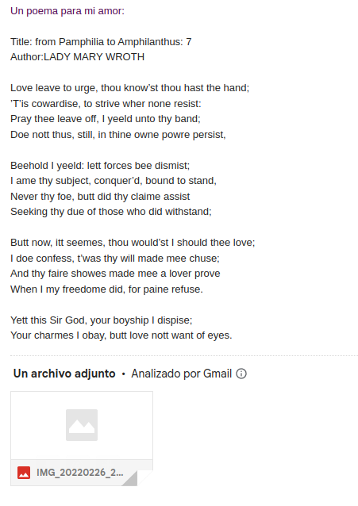

# Poetry Sender

This project involves web scraping from the website www.poetryfoundation.org. It extracts a random poem and sends it via email to the address specified by the user in the logging_keys.yaml configuration file. The project is designed to operate within a Conda environment, set up through a bash script, and supported by two Python scripts. These scripts automate the processes of creating the Conda environment, scraping the poem, and sending the email containing the random poem.

## Repository structure

```bash
├── config.yaml # Environment variables used in the scripting process
├── environments.yaml # Conda environment settings
├── logging_keys.yaml # Add a logging_keys.yaml for project replicability
├── mail_sending
│   └── send_mail.py # Automates the email-sending process with Python
├── utils.py # Defines global functions (Note: "outils" is French for "tools", but "utils" is more conventional in English codebases.)
├── poetry_sender.sh # Bash script for running the complete project
├── README.md
└── web_scraping
    └── scrape_poems.py # Automates the random selection of a poem
```

## Demo

1. Download Google Drive.
2. Provide a Gmail account to send and receive emails.
3. Populate the images folder with the desired image you wish to send.
4. Execute the Python module send_mail.py.


After execution, the recipients on your receivers list will receive a romantic poem:


